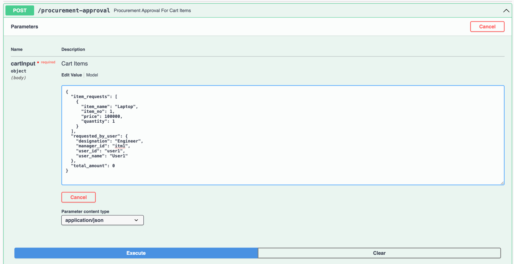
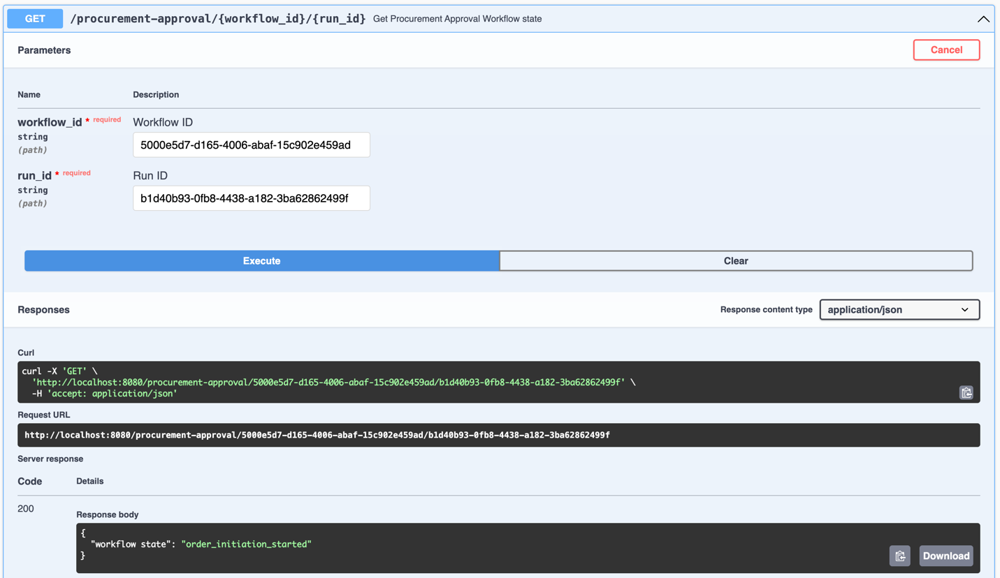

# approval-process
Temporal based approval workflow


### About the Approval Workflow Example
* Engineer raises the approval request.
* Parallel approval gets raised for ITLead and IT Manager.
* Once both the approval received and both are approved. 
    - if cart amount is more than 10000 then procurement manager has to approve.
    - else approval is not required.
* And Order gets initiated.


### To Build and Run
```
go build
```

```
./approval-process
```
### Access Application
Access application at http://localhost:8080/swagger/index.html

Input for POST api
```
{
  "item_requests": [
    {
      "item_name": "Laptop",
      "item_no": 1,
      "price": 100000,
      "quantity": 1
    }
  ],
  "requested_by_user": {
    "designation": "Engineer",
    "manager_id": "itm1",
    "user_id": "user1",
    "user_name": "User1"
  },
  "total_amount": 0
}
```


To query the state of the workflow, user workflow_id and run_id of a workflow.

